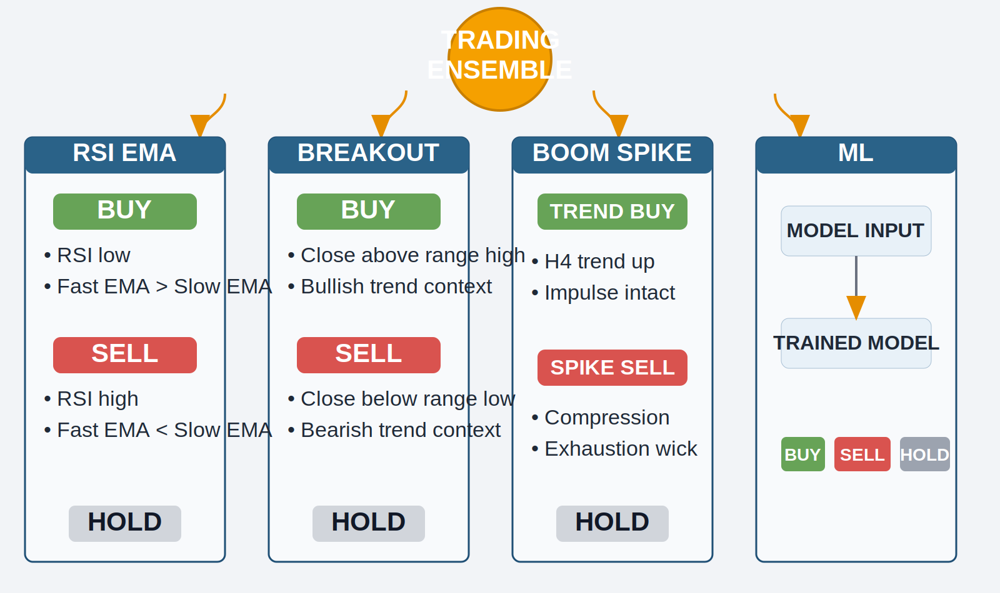
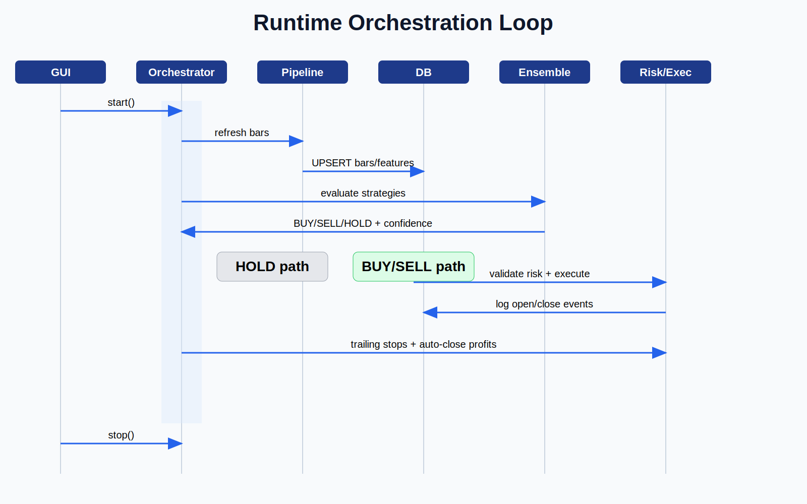
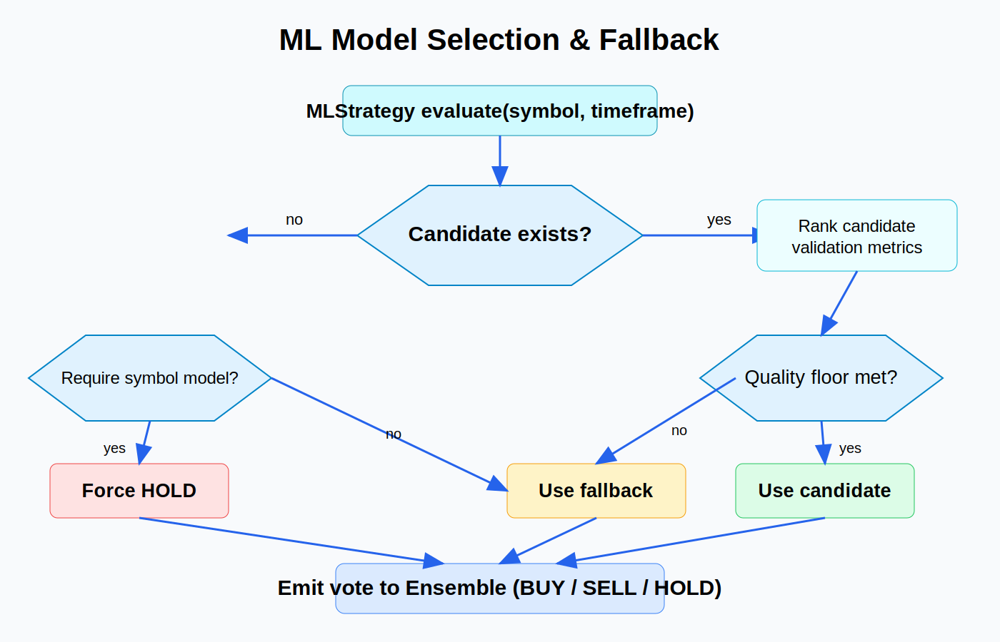
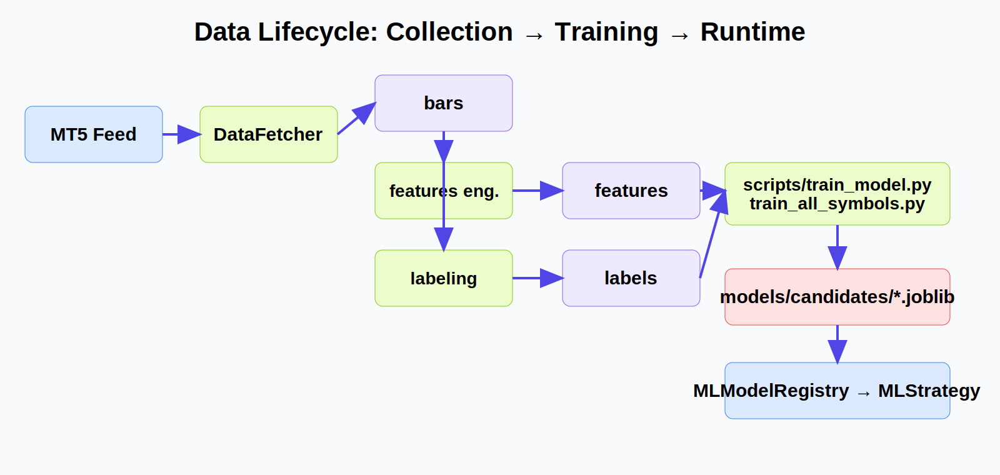
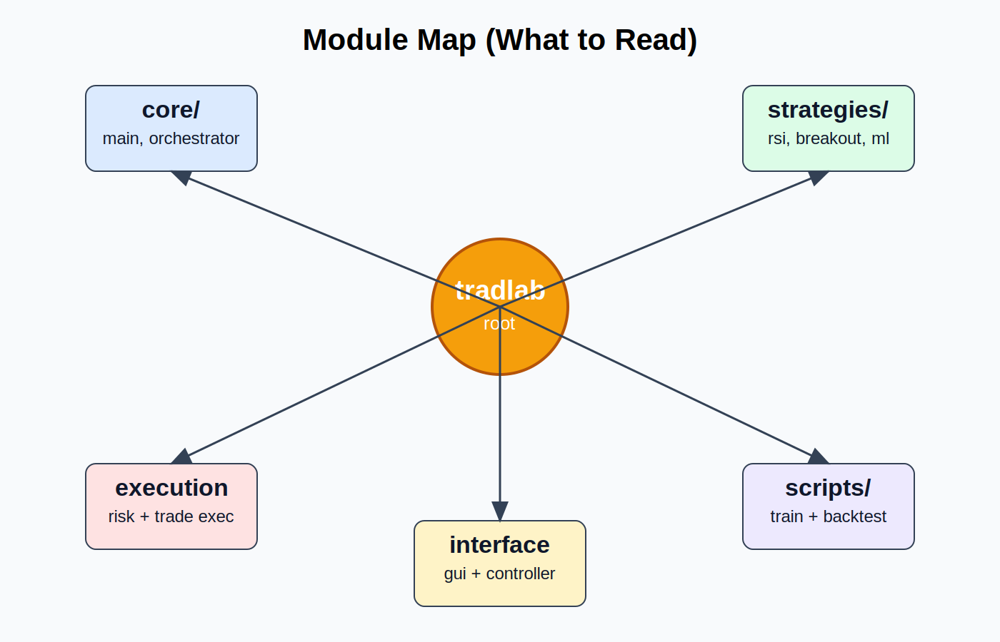

# System Architecture Diagrams

Below are exported image files for each architecture map.

## 1) Strategy + Ensemble decision board

## 2) Runtime orchestration loop

## 3) ML model selection + fallback

## 4) Data lifecycle (collection → training → runtime)

## 5) Module map

## Files

- `docs/diagrams/strategy_ensemble_board.svg`
- `docs/diagrams/runtime_orchestration.svg`
- `docs/diagrams/model_selection_fallback.svg`
- `docs/diagrams/data_lifecycle.svg`
- `docs/diagrams/module_map.svg`
